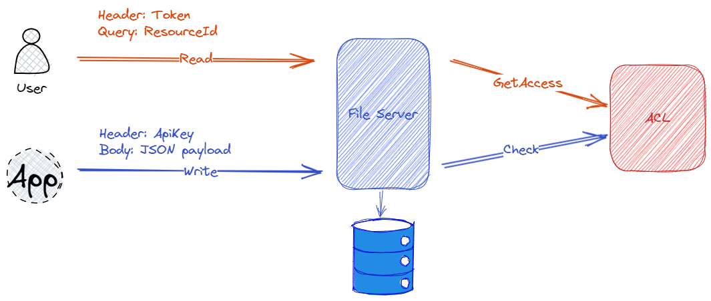

# Reactive File Server
Reactive File Server using [Quarkus](https://quarkus.io/)

Reactive File Server provides REST API for accessing and writing files to the storage. The utilization of asynchronous I/O along
with asynchronous programming provides a robust technological framework to achieve these objectives.

## Architecture
For the sake of simplicity, the File Server does not store any information about either the user or the files themselves. When a user wants to read a file, the request must contain the resource ID and an authentication token. This token is used to authenticate and authorize the user through another service where the Access Control List (ACL) is configured.

Another use case is writing a file, where an application sends the payload in Base64 format in the request body along with an API key. The File Server validates and caches the API key in this case.

## How to build it
TODO

## How to run it
TODO

